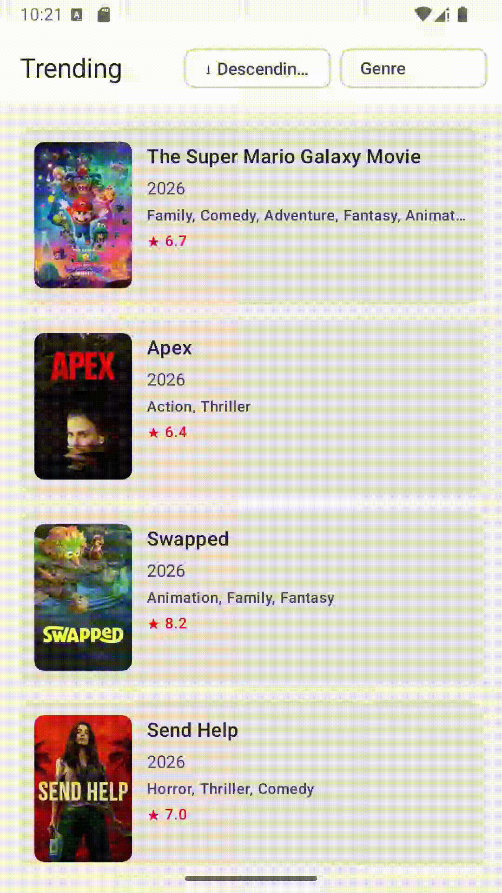

# AMRO - Movie Recommendation App

Discover this week's top 100 trending movies. Filter by genre, sort by popularity, title or release date, and tap any movie for full details including budget, runtime, and an IMDB link.

<p align="center">
  
</p>
---

## How It Works
The app fetches TMDB's trending endpoint across 5 pages (20 movies each). Rather than waiting for all 100 before showing anything, it emits after each page - the user sees the first 20 movies in ~1 second while the rest load in the background. A small spinner at the bottom of the list indicates more content is loading.

Filter and sort run entirely on the client across the full loaded dataset. Selecting a genre or changing the sort order re-applies instantly using Dispatchers.Default so the main thread stays free.

Tapping a movie fetches its full detail from a separate TMDB endpoint and shows title, tagline, genres, description, ratings, budget, revenue, runtime, release date, status, and a link to IMDB.

---

## Setup

1. Get a TMDB **Read Access Token** from [themoviedb.org/settings/api](https://www.themoviedb.org/settings/api)
2. Add to `local.properties` at the project root:
```
TMDB_API_KEY=your_read_access_token_here
```
3. Sync Gradle → Run

---

## Stack

Jetpack Compose · Hilt · Retrofit + Gson · Coil · Coroutines + Flow · MockK · Turbine

**Why Gson over Moshi:** No KSP annotation processing on DTOs. Less setup for MVP. Migrate to Moshi when JSON parsing performance becomes measurable.

**Why Hilt over Koin:** Compile-time validation. Errors surface at build time not runtime.

---

## Architecture

Clean Architecture with MVI. Three layers - data, domain, UI - each depending only on the one below it.

```
data/    → DTOs, mappers, Retrofit, MovieRepositoryImpl
domain/  → Movie, MovieDetail, NetworkResult, use cases, MovieRepository interface
ui/      → Screens, ViewModels, MVI state/events/effects
```


The `MovieRepository` interface is the key boundary. Today it fetches from TMDB. Tomorrow it fetches from Room, a second API, or both - nothing above it changes.

---

## The 100 Movies Challenge

TMDB's trending endpoint returns 20 movies per page. Three problems to solve:

**1. Show something fast.** We use `Flow` to emit after each page - the user sees 20 movies in ~1 second while pages 2–5 load in the background. `collectLatest` in the ViewModel cancels stale filter/sort computations when a newer emission arrives. Safe because each emission is cumulative (p1, then p1+p2, then p1+p2+p3) - nothing is lost.

**2. Duplicates across pages.** TMDB sometimes repeats movies on consecutive pages, crashing `LazyColumn` with "key already used". Fixed with `LinkedHashMap<Int, Movie>` - O(1) insert, insertion order preserved.

**3. Genre names need a separate API call.** The trending endpoint returns only `genre_ids`. We fetch the genre list once, cache it in memory for the session, and resolve IDs to names in the mapper. Each `Movie` carries a fully resolved `List<Genre>` - the UI never looks anything up.

---

## Key Decisions

| Decision | Why |
|---|---|
| `Flow<NetworkResult<List<Movie>>>` return type | Progressive loading - emit after each page |
| `FilterSortState` separate from `TrendingUiState` | Filter/sort survives Loading/Error state changes |
| `@StringRes` IDs in error state | ViewModel stays context-free. Screen resolves strings with `stringResource()` |
| `Response<T>` wrapper in API service | Future access to `errorBody()` and headers |
| Type-safe navigation (`@Serializable`) | Route string typos cause runtime crashes. Serializable routes fail at compile time |

---

## Tests

```bash
./gradlew test
```

| File | Covers |
|---|---|
| `FilterSortStateTest` | Filter by genre, all sort options, combined filter+sort |
| `MovieMapperTest` | DTO → domain mapping, null safety, genre resolution |
| `SafeApiCallTest` | IOException, HTTP errors, null body handling |
| `TrendingViewModelTest` | State transitions, all events, filter survives reload, snackbar vs full-screen error |
| `DetailViewModelTest` | State transitions, SavedStateHandle, retry |

---

## Known Gaps & What's Next

**Needs doing before release:**
- ProGuard rules for Gson - without them, field names obfuscate in release builds and JSON parsing silently breaks.

**Good next improvements:**
- Run genre fetch and page 1 in parallel with `async/await` - cuts time-to-first-content from ~2s to ~1.5s
- Pull-to-refresh
- Modularization: Transition from a single-module to a Feature-based Multi-module architecture (:feature:trending, :feature:detail, :core:network, :domain). This enforces strict layer boundaries and scales for team-based development.

**Future features (architecture is ready):**
- **Offline:** swap `MovieRepositoryImpl` for a Room-backed version - nothing above the interface changes
- **Multiple APIs:** add `@Named` Retrofit instances per source, repository decides which to call
- **Actor info, user profiles, streaming:** each gets its own repository interface, use cases, and screen - zero changes to existing code
